## 但行好事　莫问前程

## 数据库内容的迁移备份
* [1.同类型数据库间的导入导出](#1)
* [2.不同类型间数据库的导入导出](#2)

## <h2 id="1">同类型数据库间的导入导出</h2>
### 导出(以SqlServer为例)：
- ①借助第三方连接工具Navicat Premium
- ②连接登录SqlServer数据库：
连接数据库
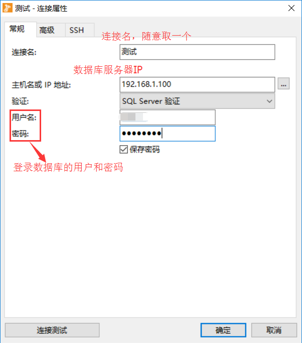

测试连接
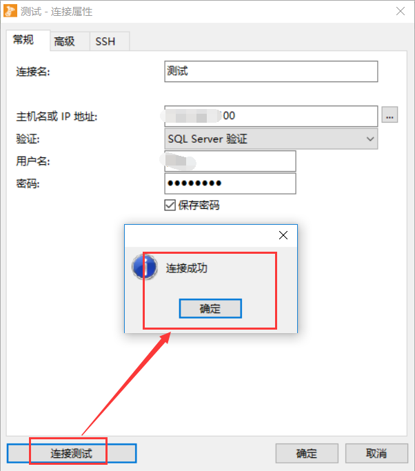
 
- ③导出数据库内容（导出为sql脚本的格式）
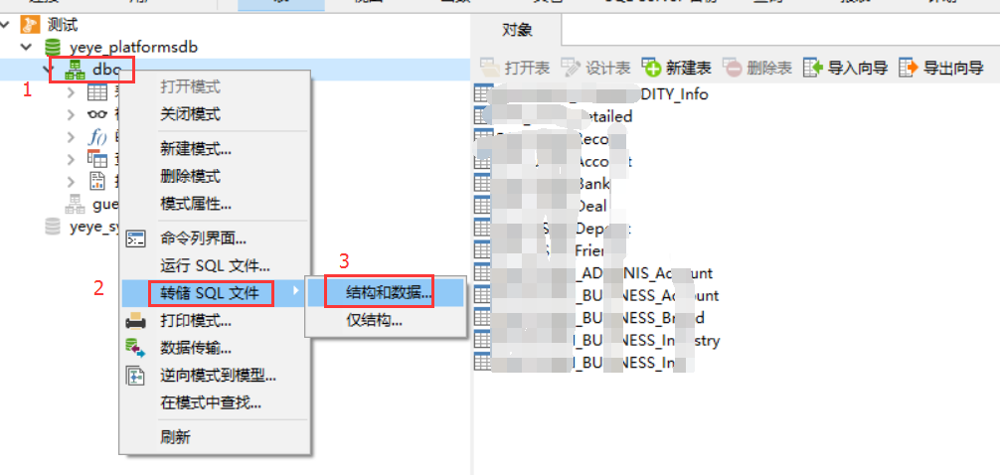
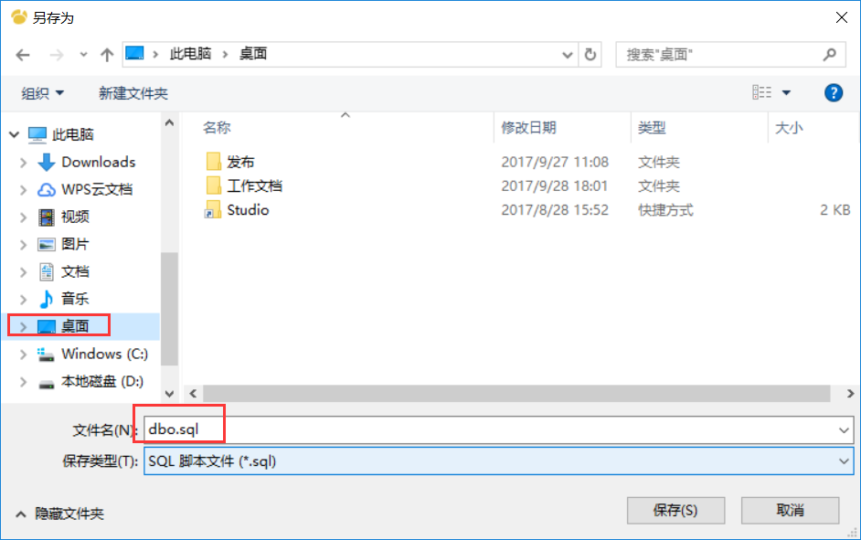
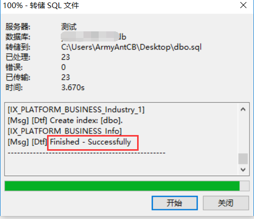
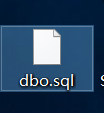

### 导入(以SqlServer为例)：
- ①建一个测试的数据库名(test)，没硬性要求，自己可根据情况建库
- ②导入(以sql脚本的格式导入)

## <h2 id="2">不同类型间数据库的导入导出</h2>
### 导出(SqlServer --> MySql)
- 步骤
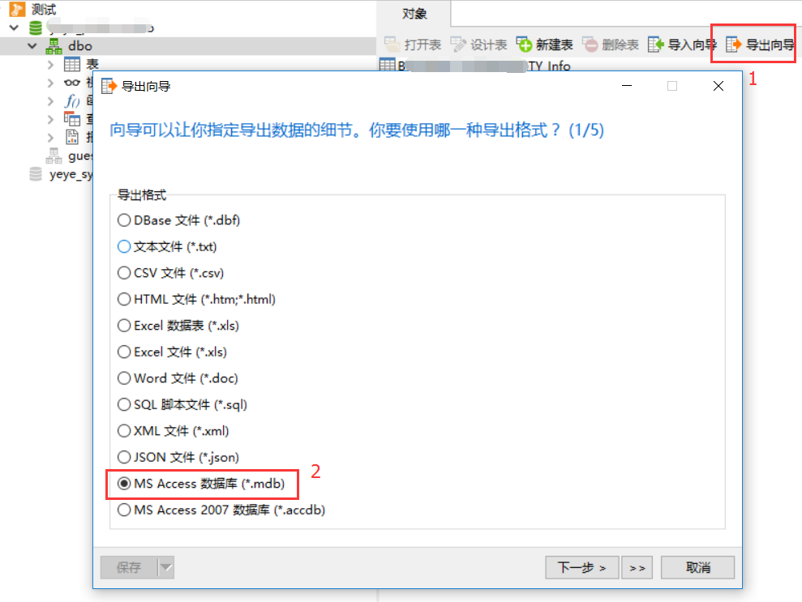
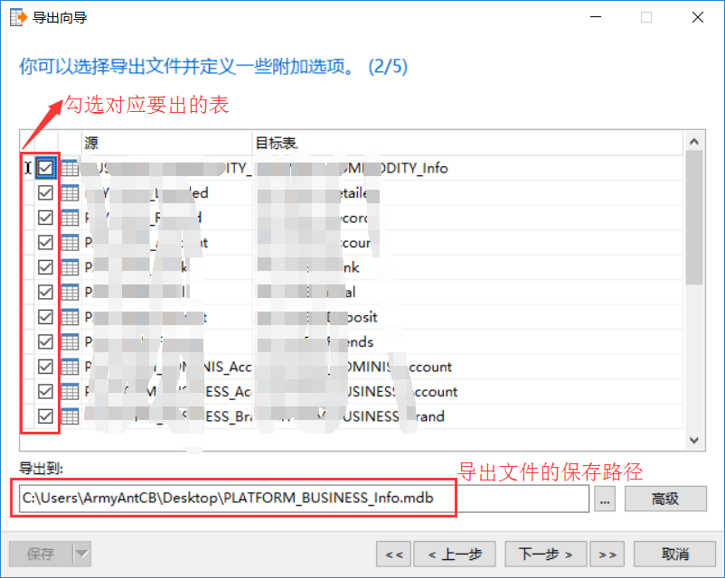
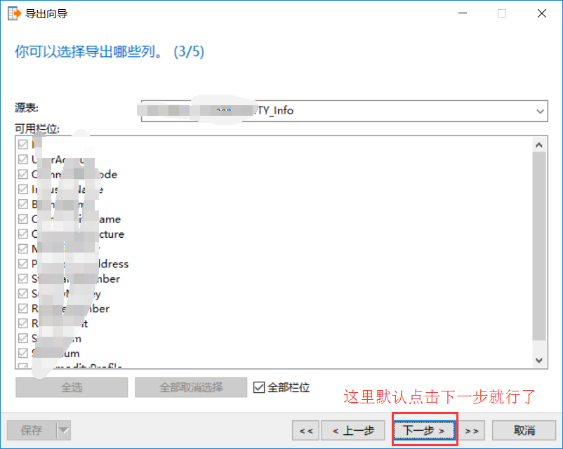
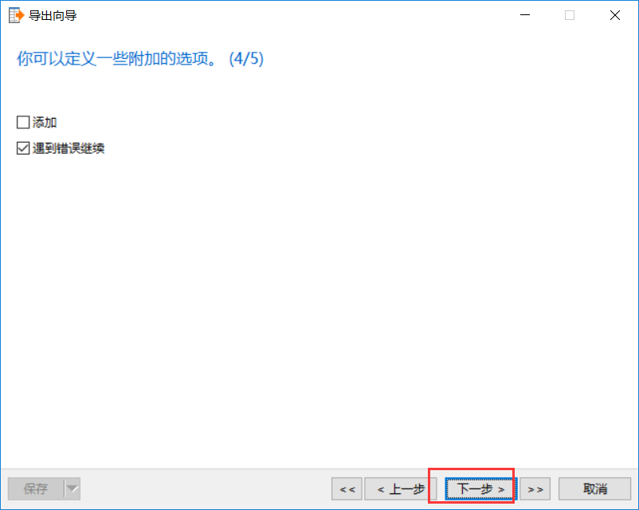
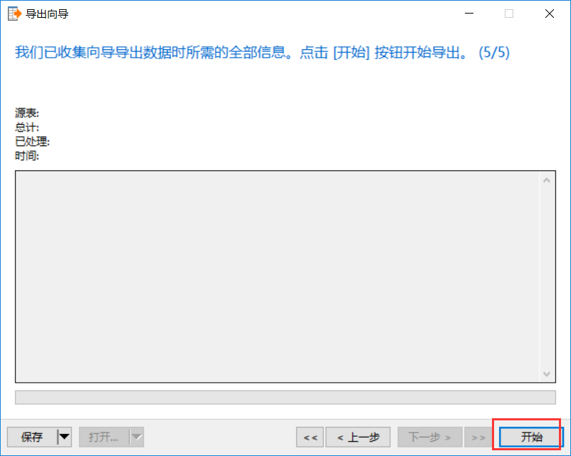
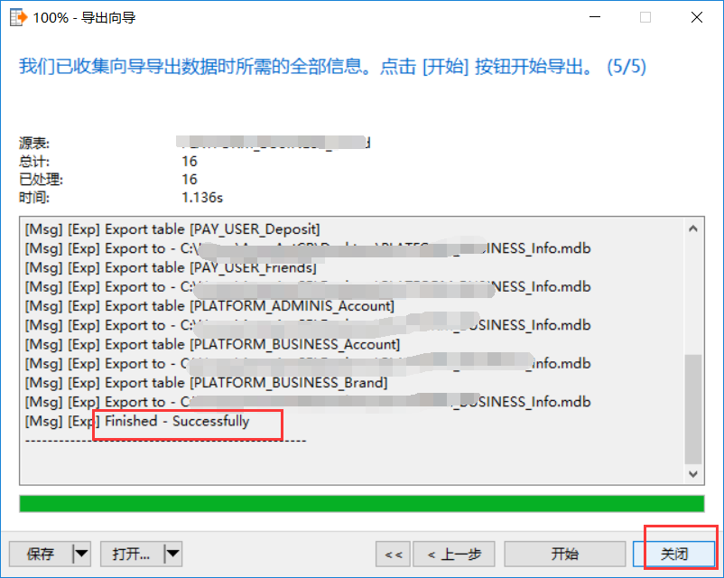
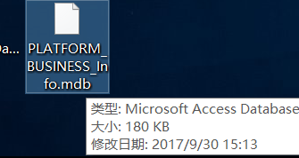

### 导入(SqlServer --> MySql)
- ①建一个测试的数据库名(test)，没硬性要求，自己可根据情况建库
- ②导入(以mdb数据库文件的格式导入)
